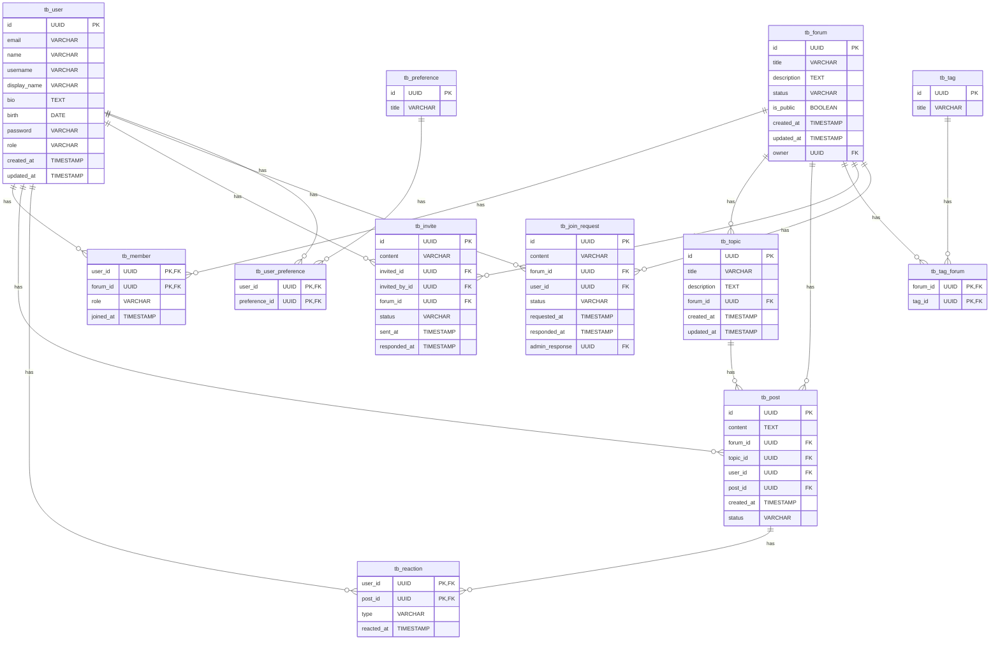

# Banco de Dados

## Tabelas

```mermaid
erDiagram
    direction TB

    tb_user ||--o{ tb_member : has
    tb_user ||--o{ tb_post : has
    tb_user ||--o{ tb_reaction : has
    tb_user ||--o{ tb_invite : has
    tb_user ||--o{ tb_join_request : has
    tb_user ||--o{ tb_user_preference : has

    tb_preference ||--o{ tb_user_preference : has

    tb_forum ||--o{ tb_member : has
    tb_forum ||--o{ tb_topic : has
    tb_forum ||--o{ tb_post : has
    tb_forum ||--o{ tb_tag_forum : has
    tb_forum ||--o{ tb_invite : has
    tb_forum ||--o{ tb_join_request : has

    tb_topic ||--o{ tb_post : has

    tb_post ||--o{ tb_reaction : has

    tb_tag ||--o{ tb_tag_forum : has

    tb_user{
        id UUID PK
        email VARCHAR
        name VARCHAR
        username VARCHAR
        display_name VARCHAR
        bio TEXT
        birth DATE
        password VARCHAR
        role VARCHAR
        created_at TIMESTAMP
        updated_at TIMESTAMP
    }

    tb_preference{
        id UUID PK
        title VARCHAR
    }

    tb_user_preference{
        user_id UUID PK,FK
        preference_id UUID PK,FK
    }

    tb_forum{
        id UUID PK
        title VARCHAR
        description TEXT
        status VARCHAR
        is_public BOOLEAN
        created_at TIMESTAMP
        updated_at TIMESTAMP
        owner UUID FK
    }

    tb_tag{
        id UUID PK
        title VARCHAR
    }

    tb_tag_forum{
        forum_id UUID PK,FK
        tag_id UUID PK,FK
    }

    tb_member{
        user_id UUID PK,FK
        forum_id UUID PK,FK
        role VARCHAR
        joined_at TIMESTAMP
    }

    tb_topic{
        id UUID PK
        title VARCHAR
        description TEXT
        forum_id UUID FK
        created_at TIMESTAMP
        updated_at TIMESTAMP
    }

    tb_post{
        id UUID PK
        content TEXT
        forum_id UUID FK
        topic_id UUID FK
        user_id UUID FK
        post_id UUID FK
        created_at TIMESTAMP
        status VARCHAR
    }

    tb_reaction{
        user_id UUID PK,FK
        post_id UUID PK,FK
        type VARCHAR
        reacted_at TIMESTAMP
    }

    tb_invite{
        id UUID PK
        content VARCHAR
        invited_id UUID FK
        invited_by_id UUID FK
        forum_id UUID FK
        status VARCHAR
        sent_at TIMESTAMP
        responded_at TIMESTAMP
    }

    tb_join_request{
        id UUID PK
        content VARCHAR
        forum_id UUID FK
        user_id UUID FK
        status VARCHAR
        requested_at TIMESTAMP
        responded_at TIMESTAMP
        admin_response UUID FK
    }
```
